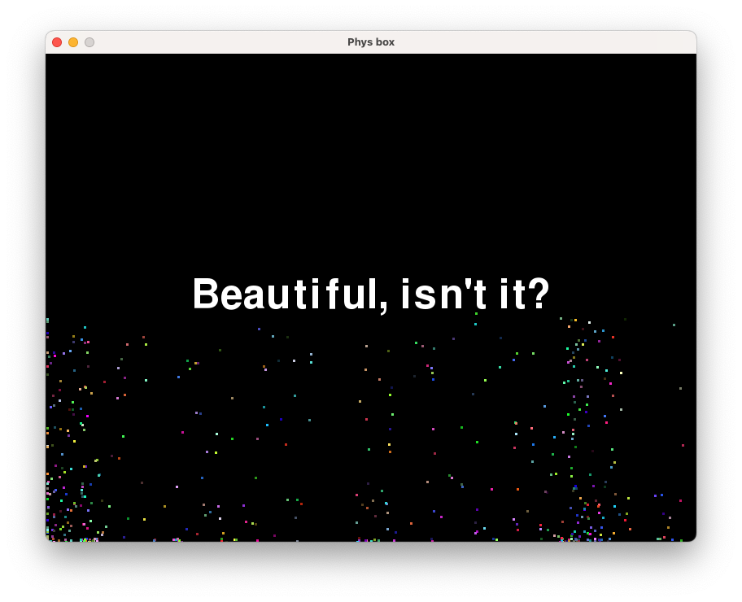

# Phys box

simple physics particles sandbox



## Description

a simple physics simulation where the player may manipulate particles in various ways. 

## How to Run

1. Make sure you have **Python 3.13** installed.
2. Install the dependencies:
   *For most of you, this is just `pip install pygame-ce`.*
3. Run the game:
   ```
   python main.py
   ```

## Controls

| Input            | Action                                       |
| ---------------- | -------------------------------------------- |
| mouse click/hold | teleports particles to cursor                |
| mouse release    | releases particles                           |
| numbers 1-5      | changes bounciness of particles              |
| hold 8           | continuously randomizes colours of particles |
| hold space       | randomizes colours of particles (once)       |
| enter/return     | advances the text on screen                  |
| X                | goes to previous text slide                  |


## Dependencies

- Python 3.13
- pygame-ce

## Assets

- `assets/explosion.mp3` - https://pixabay.com/sound-effects/film-special-effects-explosion-fx-343683/

*(If everything is your own, just say so. Credit anything you didn't make.)*

## Known Bugs / Limitations

- collision strangeness
- code redudancy

## Possible Future Improvements

- proper collision/transferring of momentum between colliding particles

## Author

Lynn
